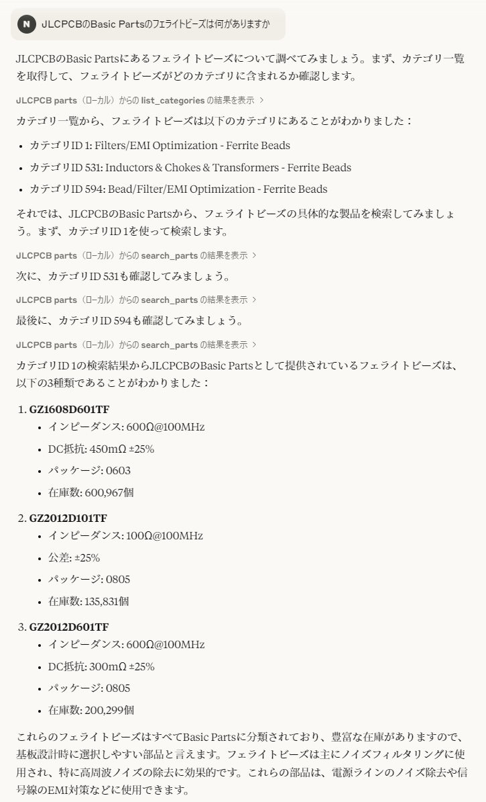

# JLCPCB Parts MCP Server

## これは何

JLCPCBのPCBA向けの、部品探しを補助するMCPサーバーです。

## 会話例

Basic Partsに分類されている、フェライトビーズを検索した例です。


また、以下のページでは降圧型DC-DCコンバータの抵抗値の選定を行っています。
https://claude.ai/share/9f02f1a4-7b38-48fb-b29a-f10cf1e608ba

## 設定

データベースとして、[JLC PCB SMD Assembly Component Catalogue](https://github.com/yaqwsx/jlcparts)を使用しています。
ここで分割ZIPにして提供されている `cache.sqlite3` が必要です。2025年4月現在、番号は `cache.z19` まで存在します。

PythonでMCPが利用可能な環境を作り、サーバーとして `server.py` を指定してください。
また、データベースへのパスを `JLCPCB_DB_PATH` 環境変数へ設定する必要があります。

Claude Desktopでの設定例を以下に示します。

```json
{
  "mcpServers": {
    "JLCPCB parts": {
      "command": "python",
      "args": [
        "path/to/server.py"
      ],
      "env": {
        "JLCPCB_DB_PATH": "path/to/database.sqlite3"
      }
    }
  }
}
```
